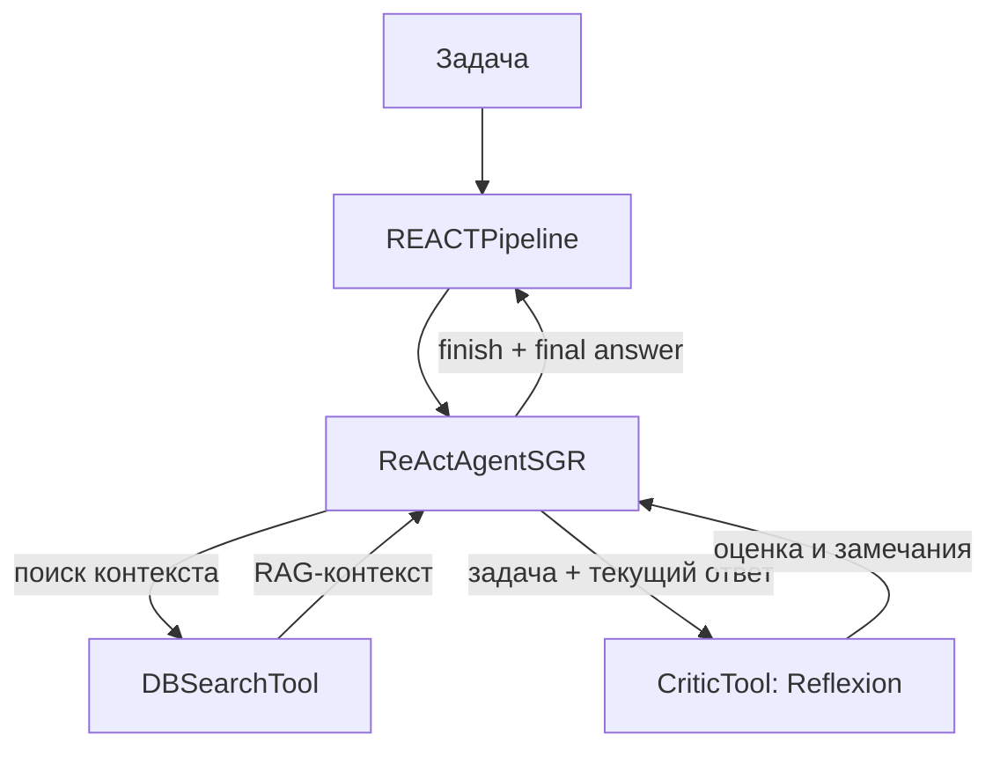

# Компонента ПМИ PCR: ReAct + RAG + Reflexion

> Руководство по переносу экспериментальной реализации в компоненту ПМИ PCR.
>
> Рекомендуемая конфигурация: **ReAct + Instruct Retriever + Reflexion как инструмент агента**.

## Назначение

В этой конфигурации ReAct-агент решает задачу итеративно и при необходимости обращается к двум инструментам:

- `db_search` — получает релевантный контекст из базы знаний;
- `reflexion` — оценивает подготовленный ответ и возвращает замечания для его улучшения.

Reflexion используется **внутри ReAct-цикла как инструмент**, а не как отдельный этап после завершения работы агента. Поэтому дополнительный solver для постобработки ответа в компоненте ПМИ не требуется.

## Схема работы



## Минимальный набор файлов

Все пути указаны относительно корня репозитория `recipe-mipt/`.

| Блок | Файл | Что необходимо перенести |
|---|---|---|
| Пайплайн | [`src/pipelines/templates/react_pipeline.py`](../src/pipelines/templates/react_pipeline.py) | Класс `REACTPipeline`, который вызывает `agent.run(task)`, нормализует оформление блоков Python-кода и возвращает итоговый ответ |
| Агент | [`src/agents/pipelines/react_sgr.py`](../src/agents/pipelines/react_sgr.py) | Системные промпты, модель шага `AgentStep`, класс `ReActAgentSGR` и логику ReAct-цикла |
| Инструмент критики | [`src/tools/critic_tool.py`](../src/tools/critic_tool.py) | Класс `CriticTool`, через который агент вызывает Reflexion |
| Инструмент RAG | [`src/tools/db_search_tool.py`](../src/tools/db_search_tool.py) | Класс `DBSearchTool`, связывающий запрос агента с retriever и context assembler |
| Reflexion | [`src/agents/critique/reflexion/main.py`](../src/agents/critique/reflexion/main.py) | Класс `Reflexion`: оценка текущего решения и генерация замечаний |
| Промпты Reflexion | [`src/agents/critique/reflexion/prompts_code.py`](../src/agents/critique/reflexion/prompts_code.py) | Инструкции и few-shot-примеры для оценки и рефлексии |
| Пример конфигурации | [`pipeline_configs/react_api_instruct_reflexion_example.yaml`](../pipeline_configs/react_api_instruct_reflexion_example.yaml) | Готовая связка ReAct + Instruct Retriever + DB Search + Reflexion |

### Что не требуется переносить

Класс `SolverReAct` из `react_sgr.py` в целевой реализации ПМИ **не нужен**. Он используется в другом режиме, где критика запускается отдельным этапом пайплайна после ReAct. Для PCR выбран режим вызова Reflexion как инструмента непосредственно внутри ReAct-цикла.

## Ответственность компонентов

### 1. Пайплайн

[`REACTPipeline`](../src/pipelines/templates/react_pipeline.py):

1. принимает исходную задачу;
2. передаёт её в `ReActAgentSGR.run(...)`;
3. выполняет минимальную нормализацию Markdown-блоков с Python-кодом;
4. возвращает `final_answer`.

При переносе важно сохранить контракт: входом является текст задачи, выходом — строка с финальным ответом агента.

### 2. ReAct-агент

Файл [`react_sgr.py`](../src/agents/pipelines/react_sgr.py) содержит:

- основной системный промпт и шаблон формирования финального ответа;
- Pydantic-модель `AgentStep` со структурой `thought / action / action_input / is_final`;
- регистрацию доступных инструментов;
- проверку аргументов инструментов;
- обработку ошибок и неизвестных инструментов;
- защиту от повторяющихся вызовов;
- скользящее окно истории;
- итерационный цикл `ReActAgentSGR.run(...)`;
- формирование итогового ответа после действия `finish`.

Агент получает инструменты через параметр `tools`, формирует их описания динамически и вызывает выбранный инструмент по имени.

### 3. Инструменты

#### `DBSearchTool`

[`DBSearchTool`](../src/tools/db_search_tool.py) принимает:

```text
query: str
```

Инструмент вызывает retriever, передаёт найденные элементы в context assembler и возвращает собранный RAG-контекст в ReAct-цикл как observation.

Для работы необходимы совместимые реализации или адаптеры для:

- `IDB`;
- `Retriever`;
- `ContextAssembler`.

#### `CriticTool`

[`CriticTool`](../src/tools/critic_tool.py) принимает:

```text
task: str
answer: str
```

В `answer` следует передавать полный текущий ответ, включая сгенерированный код: без него Reflexion не сможет корректно проверить реализацию.

При значении `name: "reflexion"` инструмент создаёт экземпляр `Reflexion` и возвращает его замечания агенту.

> **Важно:** текущий `critic_tool.py` также импортирует `Critic`, `Decrim` и `SelfRefine`. Если в PCR переносится только Reflexion, нужно удалить лишние импорты и записи из `_AGENT_REGISTRY`. Иначе потребуется перенос всех четырёх методов критики, даже если остальные методы не используются.

### 4. Метод Reflexion

Папка [`src/agents/critique/reflexion/`](../src/agents/critique/reflexion) содержит два обязательных файла:

- `main.py` — класс `Reflexion`;
- `prompts_code.py` — промпты и few-shot-примеры.

Вызов `Reflexion.run(question, answer)` состоит из двух последовательных LLM-шагов:

1. `evaluate(...)` оценивает предложенную реализацию;
2. `reflect(...)` формирует текстовую критику с учётом этой оценки.

Результатом является обратная связь, которую ReAct-агент использует для исправления или уточнения ответа.

## Конфигурация PCR

В качестве основы следует использовать файл [`react_api_instruct_reflexion_example.yaml`](../pipeline_configs/react_api_instruct_reflexion_example.yaml).

Ключевые блоки конфигурации:

| Блок | Тип | Назначение |
|---|---|---|
| `embedder` | `EMBEDDING_AGENT` | Построение эмбеддингов для поиска |
| `data_base` | `LOCAL_DB` | Документная и векторная базы |
| `context_assembler` | `INSTRUCT_CONTEXT_ASSEMBLER` | Сборка найденных фрагментов в контекст |
| `api_selector` | `API_SELECTOR` | Выбор релевантных API |
| `rationality_agent` | `API_INSTRUCT_RATIONALITY_AGENT` | Поддержка instruct retrieval |
| `retriever` | `API_INSTRUCT_RETRIEVER` | Извлечение релевантных документов и примеров |
| `tools[DB_SEARCH_TOOL]` | `DB_SEARCH_TOOL` | Доступ ReAct-агента к RAG |
| `tools[CRITIC_TOOL]` | `CRITIC_TOOL` | Доступ ReAct-агента к Reflexion |
| `agent` | `REACT_AGENT_SGR` | Основной агент |
| `logs_path` | — | Каталог логов запуска |

Для выбора Reflexion как инструмента должна быть сохранена настройка:

```yaml
tools:
  - type: DB_SEARCH_TOOL
    params:
      top_k: 5

  - type: CRITIC_TOOL
    params:
      name: "reflexion"
      url: "<critic-model-url>"
      model_name: "<critic-model-name>"
```

Перед запуском необходимо заменить значения, зависящие от окружения:

- URL и имена моделей;
- пути к документной и векторной базам;
- имя коллекции;
- путь для сохранения логов.

## Интеграционные требования

В целевой компоненте должны присутствовать собственные реализации либо совместимые адаптеры для базовых интерфейсов:

- `Agent`;
- `Pipeline`;
- `BaseTool`;
- клиента OpenAI-compatible API;
- базы данных, retriever и context assembler;
- фабрики или другого механизма сборки компонентов из YAML.

Если используется существующий `PipelineBuilder`, необходимо зарегистрировать как минимум следующие типы конфигурации:

- `REACT`;
- `REACT_AGENT_SGR`;
- `DB_SEARCH_TOOL`;
- `CRITIC_TOOL`;
- типы компонентов RAG, перечисленные в конфигурации.

## Запуск в текущем репозитории

Запуск аналогичен стандартному запуску DS-1000:

```bash
python run_ds1000.py \
  -c <путь-к-папке-с-конфигами>
```

Аргумент `-c / --config` принимает **путь к каталогу**. Скрипт последовательно запускает все файлы `*.yaml` и `*.yml` из этого каталога.

При необходимости можно также указать датасет, каталог результатов и число воркеров:

```bash
python run_ds1000.py \
  -c <путь-к-папке-с-конфигами> \
  -d <путь-к-ds1000.jsonl.gz> \
  -s <каталог-результатов> \
  -n <число-воркеров>
```

`run_ds1000.py` нужен для проверки конфигурации в текущем репозитории. В составе ПМИ вместо него может использоваться штатная точка входа компоненты при сохранении тех же контрактов пайплайна и агента.

## Чек-лист переноса

- [ ] Перенести `REACTPipeline`.
- [ ] Перенести `AgentStep`, `ReActAgentSGR` и необходимые промпты.
- [ ] Не переносить `SolverReAct`.
- [ ] Перенести `DBSearchTool` и подключить зависимости RAG.
- [ ] Перенести `CriticTool` и оставить в его реестре Reflexion.
- [ ] Перенести `reflexion/main.py` и `reflexion/prompts_code.py`.
- [ ] Зарегистрировать компоненты, используемые YAML-конфигурацией.
- [ ] Актуализировать URL моделей, имена моделей и пути к данным.
- [ ] Проверить, что агент получает оба инструмента: `db_search` и `reflexion`.
- [ ] Проверить полный проход: задача → RAG/Reflexion → `finish` → финальный ответ.
