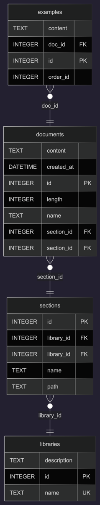
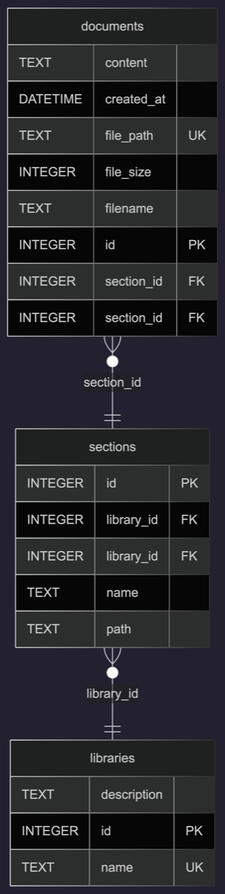

# БД с документацией для DS-1000

На данный момент БД реализована в SQLite. 

Парсер документации находится в ветке [project/parser](https://github.com/lexage/recipe-mipt/tree/project/parser)

#### Актуальная версия БД со статьями только по reference API
___

Скачать с [GoogleDrive](https://drive.google.com/file/d/1PIcv5g1RJ90Jy77c3hVkPe4oLIQjCzFK/view?usp=share_link)

#### Актуальная версия БД с разделением на примеры и теорию
___

Скачать с [GoogleDrive](https://drive.google.com/file/d/1CRyZmamupbaK4JOzwkkEPw1O1fhGjAKm/view?usp=share_link)

#### Версия БД без примров (не поддерживается)
___

Скачать с [GoogleDrive](https://drive.google.com/file/d/1qDI-WRAjrLY0HEBqKCNDDpb31EqE4KiD/view?usp=share_link)

